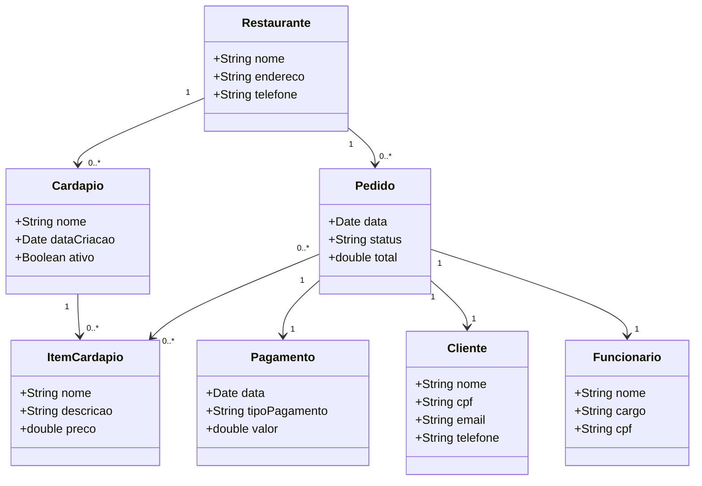

```mermaid

classDiagram
    Restaurante "1" --> "0..*" Cardapio
    Restaurante "1" --> "0..*" Pedido
    Cardapio "1" --> "0..*" ItemCardapio
    Pedido "1" --> "1" Pagamento
    Pedido "0..*" --> "0..*" ItemCardapio
    Pedido "1" --> "1" Cliente
    Pedido "1" --> "1" Funcionario

    class Restaurante {
        +String nome
        +String endereco
        +String telefone
    }

    class Cardapio {
        +String nome
        +Date dataCriacao
        +Boolean ativo
    }

    class ItemCardapio {
        +String nome
        +String descricao
        +double preco
    }

    class Pedido {
        +Date data
        +String status
        +double total
    }

    class Cliente {
        +String nome
        +String cpf
        +String email
        +String telefone
    }

    class Pagamento {
        +Date data
        +String tipoPagamento
        +double valor
    }

    class Funcionario {
        +String nome
        +String cargo
        +String cpf
    }


```